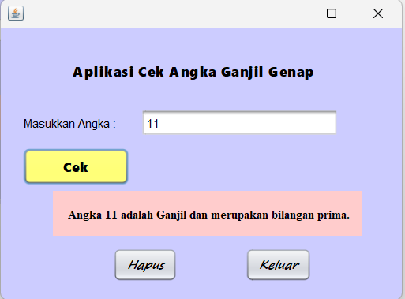

# AplikasiCekAngkaGanjilGenap
 Tugas1_NovitaFitriaRatnawati_2210010228

# Aplikasi Cek Angka Ganjil Genap 
 
 Aplikasi ini digunakan untuk menentukan apakah suatu angka adalah bilangan ganjil atau genap. Pengguna cukup memasukkan angka, dan aplikasi akan langsung menampilkan hasilnya.

# Keunggulan Aplikasi

Identifikasi Ganjil atau Genap: Aplikasi ini membantu pengguna dengan cepat dan mudah mengidentifikasi apakah suatu angka adalah ganjil atau genap.
Identifikasi Angka Prima: Aplikasi ini dapat mengidentifikasi apakah suatu angka adalah prima atau bukan
Antarmuka Sederhana: Dirancang dengan antarmuka yang mudah digunakan.

# Pembuat Aplikasi
 Novita Fitria Ratnawati - 2210010228 - Tugas 1

# Fitur

Aplikasi ini menawarkan fitur:
Mengecek apakah angka yang diinput ganjil atau Genap
Mengecek apakah angka yang diinput bilang prima atau bukan

## Cara Menjalankan

1. Run File
2. Ketikkan Angka Yang Kita Input
3. Tekan Button Cek, Maka akan keluar hasil 
4. Tekan Button Hapus untuk mengulang angka
4. Tekan Button Keluar, jika ingin keluar 

# Demo
